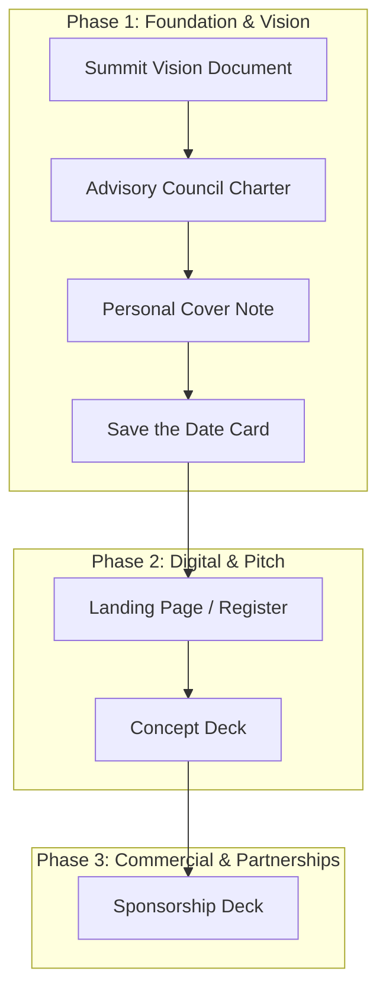

# Collaterals Scoping & Prioritization Plan — The Schools of India Summit

This plan structures and prioritizes the 8 requested event collaterals into logical phases based on strategic dependencies, detailing the exact resources, copy guidelines, and assets required to build each one.

---

## 📅 Part 1: Prioritization Roadmap

We recommend executing the deliverables in three strategic phases. This ensures that the core vision and board recruitment elements are locked in before building the marketing and commercial decks.

### Phase 1: Foundation & Vision (Immediate Priority)
*Focus: Locking down the core narrative, establishing advisor rules, and preparing initial outreach assets.*
1. **A One-Page Summit Vision Document**: Establishes the summit's north star, giving credibility to everything that follows.
2. **The Founding Advisory Council Charter**: Defines the roles and incentives for advisors to secure their participation.
3. **A Personally Signed Cover Note (from Antigravity)**: The personal, warm outreach template to invite leaders.
4. **"Save the Date" Card (featuring Imagicaa & Novotel Visuals)**: The visual hook for outreach.

### Phase 2: Digital Presence & Core Pitch (Medium Priority)
*Focus: Setting up the registration hub and detailed event decks for advisors/delegates.*
5. **Basic Landing Page to Register Interest**: The web portal where contacts go to RSVP or learn details.
6. **Concept Deck**: The slide-by-slide overview of the summit's content, themes, and schedule formats.

### Phase 3: Commercial & Partnerships (Final Output)
*Focus: Securing funding and corporate partners.*
7. **Sponsorship Deck**: Pitch deck for sponsors (exhibitors, tech partners, title sponsors). Requires a finalized vision and advisory board roster to be effective.

---

## 🛠️ Part 2: Requirements for Each Collateral

Below is the list of everything needed from you (or what I will generate/synthesize) to build each deliverable:

### 1. One-Page Summit Vision Document
* **What we need to build it**: Confirming the key sub-themes (AI, school operations, student wellbeing) and target audience size (e.g. 500+ leaders).
* **Delivery format**: Clean, printable A4 markdown document with strategic headers.

### 2. Founding Advisory Council Charter
* **What we need to build it**: 
  * Advisory Board structure (how many seats, e.g., 10-12).
  * Engagement expectations (number of virtual review meetings, summit presence).
  * Incentives (VIP passes, speaking slots, honorary features).
* **Delivery format**: Policy document draft detailing responsibilities and privileges.

### 3. Personally Signed Cover Note (from Antigravity)
* **What we need to build it**: Preferred writing tone (e.g. warm, intellectual, tech-visionary) and sign-off signature details.
* **Delivery format**: Professional copy-pasteable email template.

### 4. "Save the Date" Card
* **What we need to build it**: 
  * Confirming location coordinates (specifically **Novotel Imagicaa Khopoli**, near Mumbai/Pune).
  * Visual assets for Imagicaa (theme park/entertainment visual) and Novotel (modern luxury resort visual).
* **Delivery format**: High-fidelity graphic designed landscape card (generated using `generate_image` based on the brand book styling guidelines).

### 5. Basic Landing Page to Register Interest
* **What we need to build it**:
  * Fields required in the registration form (Name, School Name, Role, Email, Phone, Interest Type).
  * Hosting details (already deployed on Netlify, we can set this up as a standalone `/register.html` page).
* **Delivery format**: Semantic HTML, clean CSS, and JS form-validation scripts.

### 6. Concept Deck
* **What we need to build it**:
  * Slide dimensions preference (16:9 widescreen default).
  * Main tracks details (Day 1: Leadership, Day 2: Pedagogy, Day 3: Scaling).
* **Delivery format**: Complete slide-by-slide copy outline, layout diagrams, and CSS color codes matching the brand book.

### 7. Sponsorship Deck
* **What we need to build it**:
  * Sponsorship tiers pricing (e.g., Title: ₹5,00,000, Associate: ₹2,50,000, Exhibitor: ₹1,00,000).
  * Specific deliverables per tier (exhibition stall size, main stage logo size, speaking slot minutes, email newsletter blast count).
* **Delivery format**: Structured table matrix and slide copy outline.
