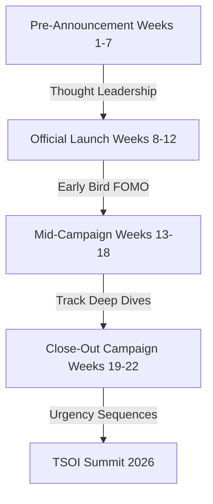

# Marketing Roadmap — TSOI 2026

This roadmap details the marketing campaigns, collateral deadlines, and audience acquisition funnels aligned to support the summit's official launch on **1st August 2026**.

---

## 📅 Part 1: Collateral Development Timeline (July 5 — July 31)

To hit the August 1st launch date, marketing collaterals are developed in parallel alongside operational milestones:

```
[July 5-15] ──► Draft track overview decks, venue overview sheets, & advisor welcome cards
[July 16-25] ─► Draft invite emails, pre-launch LinkedIn assets, & cohort templates
[July 26-31] ─► Set up registration forms, load pricing gates, & sync schedules
```

*   **Weeks 1 & 2 (July 5 – July 15)**:
    *   *Deliverables*: Draft Track Overview Decks, Venue Overview Sheets, and advisor welcome graphics (using transparent advisor PNGs layered over the brandbook-styled domes).
*   **Weeks 3 & 4 (July 16 – July 25)**:
    *   *Deliverables*: Draft invitation cover emails, pre-launch LinkedIn post calendars, and cohort registration templates.
*   **Week 5 (July 26 – July 31)**:
    *   *Deliverables*: Lock landing page registration forms, configure Early Bird pricing code gates, and finalize schedule syncs.

---

## 📅 Part 2: Campaign Acquisition Roadmap



### 1. The Pre-Launch Pipeline (July 5 — July 31)
*Goal: Generate industry curiosity and position the summit as the premier executive school summit.*
*   **LinkedIn/Social Placement**:
    *   Publish weekly advisor onboarding posts as they are secured (July 5–15).
    *   Share agenda previews and core themes debated by advisors (July 22–31).
*   **Database Warm-up**:
    *   Send out "Save the Date" emails to database lists to prepare contacts for the August 1st ticket launch.

### 2. Launch Campaign: The Early Bird Surge (August 1 — August 20)
*Goal: Secure 30% of target seat capacity within the first 3 weeks.*
*   **Direct Invitation Drop**:
    *   Send the finalized interactive invite and compiled portrait concept deck to school founders and trustees on August 1st.
*   **Tier 1 Pricing Gate**:
    *   Introduce "Early Bird passes" limited to the first **75 schools** or a strict **August 20th cutoff**, whichever comes first.

### 3. Track-focused Campaign (August 21 — September 15)
*Goal: Target mid-level administrators and principals through segmented marketing.*
*   **Dedicated Outreach**:
    *   Focus marketing segments on specific tracks (e.g., curriculum audits for academic coordinators, operations sandboxes for trustees).

### 4. Closeout Urgency Campaign (September 16 — Event Date)
*Goal: Lock remaining ticket inventory.*
*   **Urgency Retargeting**:
    *   Deploy FOMO campaigns showcasing registered schools and announcing the closure of VIP pass tiers.
