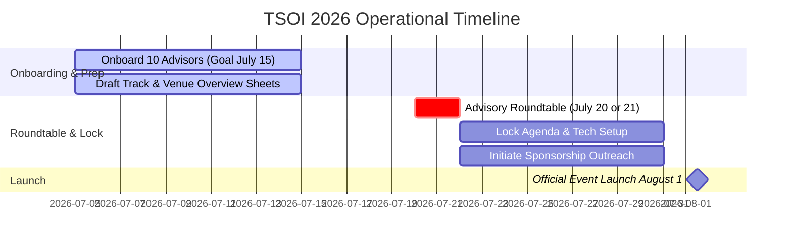

# Operational Roadmap — TSOI 2026

This roadmap structures the operational milestones required to onboard the Advisory Council, finalize the conclave curriculum, coordinate sponsorship outreach, and launch the event on **1st August 2026**.

---

## 📅 Part 1: Operational Timeline

### Phase 1: Onboarding & Preparatory Assets
* **Timeline**: 5th July — 15th July 2026 (10 Days)
* **Action Items**:
    *   **Advisor Recruitment**: Send direct invites using locked templates and mobile PDFs to secure 10 Founding Advisors by July 15th.
    *   **Roundtable Asset Drafting (Parallel Task)**: Draft the **Track Overview Decks** and **Venue Overview Sheets** during this phase so they are fully prepared to be presented to the advisors.
*   **Deliverable (July 15)**: Confirmed Advisory Council and completed decks/sheets ready for presentation.

### Phase 2: The Advisory Conclave (Virtual Roundtable)
* **Timeline**: 20th or 21st July 2026
* **Action Items**:
    *   Convene the 10 advisors in a virtual roundtable.
    *   **Presentations to the Board**:
        *   Present the drafted Track Overview Decks and Venue Overview Sheets.
        *   Present detailed agenda options, schedule formats, topics, and delegate seat pricing tiers.
*   **Deliverable (July 21)**: Meeting feedback log, track assignments, and moderator consensus.

### Phase 3: Consensus Lock, Tech Setup & Sponsorships
* **Timeline**: 22nd July — 31st July 2026
* **Action Items**:
    *   **Agenda & Tech Lock**: Sync finalized schedule and seat pricing into [cms-data.js](file:///Users/huzayfa/Documents/antigravity/brave-euclid/cms-data.js) to prepare the landing page.
    *   **Sponsorship Outreach (Parallel Task)**: Initiate sponsorship outreach to secure partners:
        *   *Target Profile*: Organizations in the Education Sector or sectors supporting education.
        *   *Exclusion Rule*: Do not invite direct competitors.
*   **Deliverable (July 31)**: Completed CMS website configurations and initial sponsor pitch roster.

### Phase 4: Official Launch & Announcement
* **Timeline**: 1st August 2026
* **Action Items**:
    *   Go-live with the official registration landing page featuring confirmed advisors, speakers, and schedules.
    *   Release the first-tier ticket inventory (Early Bird Passes) to the target database.
*   **Deliverable (August 1)**: Public launch of the summit and active registration channels.
